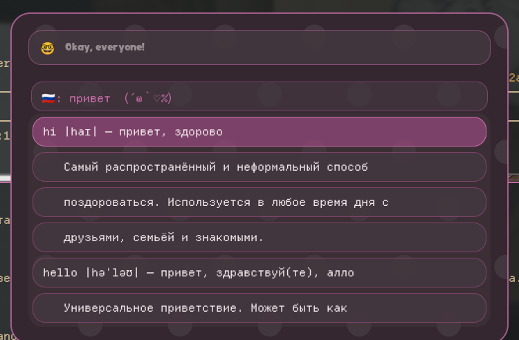
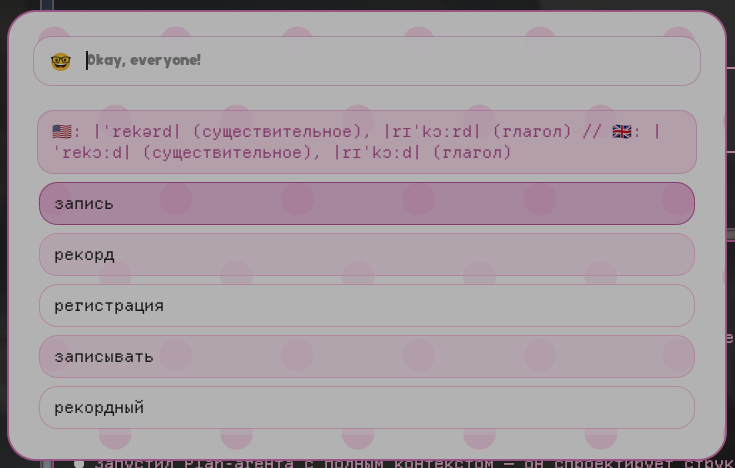
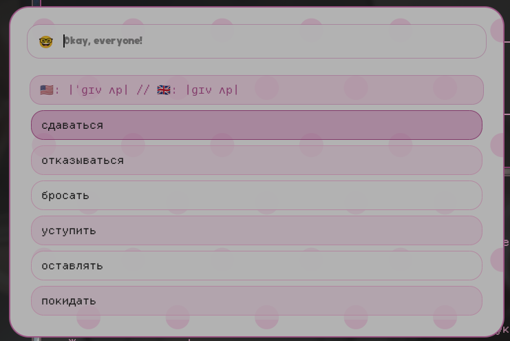

<div align="center">

# rofi-wooordhunt

**Парсер Wooordhunt в rofi** 🤓


[](LICENSE)
[](https://github.com/rokokol/rofi-wooordhunt/actions/workflows/build.yml)

[English](README.md)

</div>

Набрал слово, получил перевод, нажал Enter — он в буфере. **Оба направления в одном поле**: [wooordhunt.ru](https://wooordhunt.ru) сам разбирается, что ты имел в виду, так что переключать режим и помнить префикс не нужно

Дойти до вкладки браузера — это окно, загрузка страницы и дорога обратно. Тут одна клавиша

Приехало из моего райса, **[rokokol/huix](https://github.com/rokokol/huix)**

```sh
# попробовать на живой сессии, ничего не устанавливая
nix run github:rokokol/rofi-wooordhunt
```

## Что приходит в ответ

**Русский на входе** — английские слова, у каждого своя транскрипция, свой список значений и объяснение сайта, когда брать именно это слово, а не соседнее:



Ради этого объяснения русское направление и нужно: список из шести синонимов не говорит ничего о том, какой из них выберет носитель, а объяснение говорит. Отступленные строки **невыбираемые** — стрелки их пропускают, так что объяснение читается как примечание под словом, а не как ещё девять вариантов выбора

**Английский на входе** — транскрипции в шапке, по одной на часть речи, если написание покрывает несколько слов, и значения строками:



Enter копирует запись. У слова с объяснением копируется **слово**, а не та строка, на которой стоял курсор

Фразы из нескольких слов тоже работают. Пробел превращается в подчёркивание, которого ждёт сайт:



Цвета и скруглённые строки — **не** отсюда: это моя тема для rofi, она живёт в [huix](https://github.com/rokokol/huix/tree/master/home-manager/programs/rofi). Modi выдаёт только строки и имя режима, а как они выглядят — дело твоего rofi

## Установка

### Home Manager

```nix
{
  inputs.rofi-wooordhunt.url = "github:rokokol/rofi-wooordhunt";

  # в home-конфигурации
  imports = [ inputs.rofi-wooordhunt.homeManagerModules.default ];

  programs.rofi-wooordhunt.enable = true;
}
```

Модуль ставит пакет и на этом заканчивается. Режим называет себя сам через протокол script-modi — **в конфиг rofi не уходит ничего**, никакой строки `display-dictionary`, которую надо держать в синхроне, — а клавиша остаётся твоей: бинд это вкус, и живёт он в твоём конфиге, а не в чужом модуле:

```conf
bind = SUPER, Y, exec, rofi-wooordhunt
```

| опция | | по умолчанию |
| --- | --- | --- |
| `prompt` | как rofi подписывает режим | `🤓` |
| `copyCommand` | чем копировать выбранную запись | `wl-copy` |
| `wrapWidth` / `headWidth` | где переносятся строки; для широкого окна расширять обе | `54` / `58` |
| `timeout` | сколько секунд отводится запросу | `5` |

### Любой другой дистрибутив

```sh
git clone https://github.com/rokokol/rofi-wooordhunt
cd rofi-wooordhunt
sudo ./install.sh          # PREFIX=~/.local ./install.sh для пользовательской установки
```

Ничего не собирается: оба скрипта копируются в `$PREFIX/share/rofi-wooordhunt`, а в `$PREFIX/bin` линкуется только лаунчер

Нужны `bash`, `curl`, [`pup`](https://github.com/ericchiang/pup), `jq`, `awk`, `sed`, `grep`, `xargs` и что-нибудь для буфера — по умолчанию `wl-copy`, на X11 `ROFI_WOOORDHUNT_COPY="xclip -selection clipboard"`

Дальше бинд руками, та же строка, что выше:

```conf
bind = SUPER, Y, exec, rofi-wooordhunt
```

### Два файла, на PATH один

`rofi-wooordhunt` — это **лаунчер**: он запускает rofi и отдаёт ему парсер как script-modi, абсолютным путём. Парсер — `wooordhunt-modi` — лежит в `libexec` и на PATH не появляется: rofi дёргает его на каждое нажатие, а руками его не запускают. Ради этого всё и затевалось — бинд стал одним словом вместо заклинания `rofi -show … -modi "…"`, которое иначе приходится копировать в каждый конфиг.

Запрос из командной строки становится начальным фильтром rofi, так что `rofi-wooordhunt транзистор` открывается с уже заполненной строкой поиска.

Он же — **режим твоего собственного rofi**, рядом с чем угодно ещё: наводишь rofi на лаунчер, и тот уступает место парсеру:

```sh
rofi -show dictionary -modi "dictionary:rofi-wooordhunt,emoji:rofimoji"
```

Уступка нужна потому, что rofi отказывается запускаться внутри rofi (он держит pid внешнего экземпляра в `ROFI_OUTSIDE` и проверяет, жив ли тот). Лаунчер, увидевший в окружении `ROFI_RETV`, понимает, что его приняли за режим, и отдаёт работу парсеру, а не rofi, который всё равно не стартует.

`rofi-wooordhunt --modi` печатает, где этот парсер лежит, — строке выше это не нужно, флаг нужен, чтобы навести rofi прямо на него или посмотреть, что вообще запускается. Под Nix там окажется обёртка `makeWrapper`, а не завёрнутый скрипт: голый скрипт не найдёт ни `curl`, ни `pup`.

## Настройки

Под каждой опцией Home Manager лежит переменная окружения, так что те же ручки работают и без Nix:

| | |
| --- | --- |
| `ROFI_WOOORDHUNT_PROMPT` | подпись режима в rofi |
| `ROFI_WOOORDHUNT_COPY` | команда копирования |
| `ROFI_WOOORDHUNT_WRAP_WIDTH` | ширина переноса отступленного объяснения |
| `ROFI_WOOORDHUNT_HEAD_WIDTH` | докуда может дорасти строка слова, прежде чем значения уедут вниз |
| `ROFI_WOOORDHUNT_TIMEOUT` | таймаут одного запроса в секундах |
| `ROFI_WOOORDHUNT_URL` | корень сайта — навести modi на зеркало или на дерево фикстур |
| `ROFI_WOOORDHUNT_LOCALE` | локаль, в которой перенос считает символы; без неё modi берёт первую UTF-8-локаль, на которую машина реально отзывается |

Перенос свой, потому что **строка rofi однострочная**: то, что не влезло, обрезается многоточием, а не переносится, поэтому длинное объяснение приходится ломать на строки руками. Отсюда обе ширины — функция ширины окна; значения по умолчанию рассчитаны на 720px

`rofi-wooordhunt --help` печатает тот же список. Набранный в поле поиска `--help` — просто запрос: у парсера своих опций нет, любой аргумент для него слово к переводу

## Как это устроено

API нет. Modi забирает страницу и читает её `pup` и `jq` — этого хватает, потому что вёрстка регулярная, — но у сайта **четыре разных формы** для одного, казалось бы, ответа, и парсер идёт по ним по порядку:

| на странице | это | как показывается |
| --- | --- | --- |
| `section.sub_entry` | русское направление: группы синонимов, у каждой список значений и объяснение | слово + транскрипция, объяснение с отступом ниже |
| `.t_inline_en` | английское направление, значения одной строкой | по строке на значение |
| `.tr > span` | английское направление, по значению на span | по строке на значение; разметка span схлопывается вручную, чтобы `<i>(чрезмерно)</i> подчёркивать` осталось одним значением |
| `.light_tr` | страница фразы | перевод одной строкой |

Транскрипции лежат в другом блоке, не там, где значения (`.trans_sound`), а у русского направления их нет вовсе — поэтому на русский запрос modi параллельно тянет словарную страницу **каждого** английского результата ровно ради транскрипции. Слово, чья страница не ответила, просто появится без неё

Из-за омографов этот блок обходится, а не грепается: `transfer` — это два слова с двумя произношениями на одной странице, и `grep` по первому `.transcription` уверенно покажет не то

## Тесты

```sh
tests/run.sh              # 19 проверок, без сети
tests/run.sh --update     # перезаписать эталон после осознанного изменения
tests/live.sh             # те же вопросы, но живому сайту
tests/refresh.sh [dir]    # перекачать сохранённые страницы по таблице routes
```

`tests/run.sh` кладёт в PATH подставной `curl`, который отдаёт сохранённые страницы из `tests/fixtures` по таблице `tests/fixtures/routes`, и сверяет выданный modi протокол rofi с `tests/golden` — так изменение в сборке ответа видно диффом. Два зарезервированных слага изображают отказы, которых сохранённой страницей не выразить: таймаут и транспортную ошибку

Сети тут нет вообще, и в этом же ограничение: **фикстуры продолжают парситься и после того, как сайт перестал на них походить**. Поэтому [еженедельный workflow](.github/workflows/upstream.yml) делает две вещи, недоступные офлайновому набору:

- `tests/live.sh` задаёт те же вопросы самому wooordhunt и проверяет форму ответа, а не формулировки
- `tests/refresh.sh fresh` перекачивает каждую страницу из `routes`, и весь офлайновый набор прогоняется **против свежей копии**. Разошедшийся эталон там — это и есть поехавшая вёрстка сайта, тот единственный отказ, который офлайновый набор сам породить не может. Свежий комплект выкладывается артефактом прогона, так что перезапись — это скачать и закоммитить

Побайтовое совпадение HTML намеренно не является критерием: пройдёт или нет, решает разобранный вывод — иначе рекламный блок красил бы прогон каждую неделю. А поехал ли сам HTML, пишется в сводку прогона

`nix flake check` прогоняет офлайновый набор плюс: упакованная обёртка разбирает настоящую страницу настоящим `curl`, каждая настройка доезжает до скрипта, модуль Home Manager вычисляется против заглушек опций

## Структура

```
rofi-wooordhunt.sh   лаунчер: единственное, что на PATH, запускает rofi с modi
wooordhunt-modi.sh   modi: запрос, разбор, вывод протокола rofi
nix/                 package.nix, module.nix, module-test.nix
tests/               run.sh, live.sh, refresh.sh, сохранённые страницы и эталонный вывод
docs/                скриншоты
install.sh           для систем без Nix
```

## Лицензия

MIT
